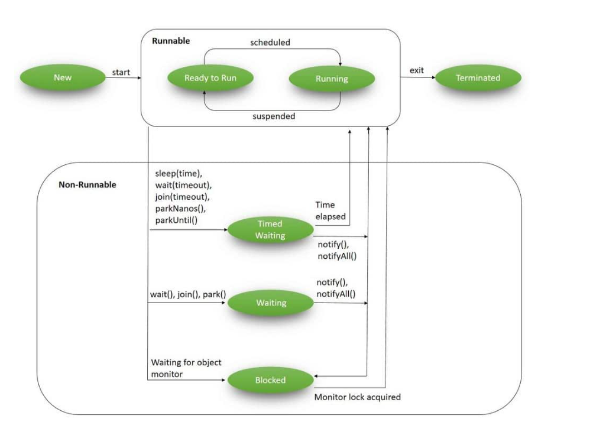

# 🧵 Multithreading in Java

## 📁 Class: [`3_SomePlayingStuff.java`](_3_SomePlayingStuff.java)

```java
package day1;

public class _3_SomePlayingStuff extends Thread {

    @Override
    public void run() {
        System.out.println("Same signature as in superclass - run()");
    }

    public void run(int a) {
        System.out.println("Overloaded run method with one argument");
        System.out.println("Value : " + a);
    }

    @Override
    public void start() {
        // This overrides the Thread class's start() method,
        // so the custom run() will NOT be called unless you call it explicitly.
        System.out.println("start() method overridden from Thread class");
    }

    public static void main(String[] args) {
        Thread th = new _3_SomePlayingStuff();
        th.start(); // Calls the overridden start(), NOT run()
    }
}
```

## 🧠 Explanation

- ✅ Even though `run()` is overridden, it is **not** called because `start()` is also overridden.
- ❌ The default behavior of `Thread.start()` (which internally creates a new thread and calls `run()`) is bypassed.
- ✅ Since `start()` is overridden and doesn't call `super.start()`, no new thread is created, and `run()` is not executed.

---

## 🧪 Output
start() method overridden from Thread class


---

## 📌 Key Concepts

- ✅ Overriding `run()` allows your thread to execute custom logic when `start()` is called.
- 🚫 Overloading `run(int a)` or any other variant has no effect on thread behavior.
- ⚠️ If you override `start()`, you must call `super.start()` manually to actually create a new thread.
- ❗ It's not recommended to override `start()` unless there's a specific need (like instrumentation or custom behavior).

---

## ✅ Fix / Recommendation

### ✅ Option 1: Don't override `start()` (Recommended)

```java
@Override
public void run() {
    System.out.println("Thread logic here.");
}
```

### ✅ Option 2: If you must override start(), call super.start() manually

```java
@Override
public void start() {
    super.start(); // Ensures the thread is actually started
    System.out.println("Custom logic in start()");
}
```

## 🔁 Summary

- ❗ Your current logic does not create a new thread.
- ❌ run() is not called.
- ✅ To fix it:
- Either **don’t override start()**, or
- If you override it, make sure to call `super.start()` inside.

## 🤔 Creating Threads: Extending Thread vs Implementing Runnable

In Java, there are two common ways to create a new thread:

### 1️⃣ Extending the Thread class:
You create a new class that extends Thread and override the run() method.
```java
class MyThread extends Thread {
    @Override
    public void run() {
        System.out.println("Thread running");
    }
    public static void main(String[] args) {
        System.out.println("Hello Testing : Creating thread by extending the Thread class...............");
        MyThread t = new MyThread(); // step-3: Instantiate the class which extended the Thread class.
        t.start(); // Step-4 : To Run the thread  by calling start() method of Thread class, this will implicitly called the run() method. Note: We can't directly call the run(). If we call then it will run but there won't be create any thread.
    }
}
```

### 2️⃣ Implementing the Runnable interface:
Then you create a Thread by passing an instance of your Runnable to its constructor:
```java
class MyRunnable implements Runnable {
    @Override
    public void run() {
        System.out.println("Thread running");
    }

    public static void main(String[] args) {
        System.out.println("Hello Testing : Creating thread by implementing the Runnable Interface...............");
        MyRunnable th = new MyRunnable(); // step-3: Instantiate the class which implements the Runnable Interface.
        Thread thread = new Thread(th);// step-4: Create the Thread object. Or we can  direclty pass with new and the class which implements the Runnable Interface.
        //Thread thread = new Thread(new _2_CreateThreadByImplRunnableIntrface());// step-4: like this.
        thread.start(); // Step-5 : To Run the thread  by calling start() method of Thread class, this will implicitly called the run() method. Note: We can't directly call the run(). If we call then it will run but there won't be create any thread.

    }

}
```

# ✅ Which approach is better and why?

## Advantages of implementing Runnable:

- **More flexible:** Your class can extend any other class (since Java allows only single inheritance), making Runnable ideal for when your class already extends something else.
- **Separation of concerns:** Runnable encapsulates only the task to run, while the Thread object handles thread management. This leads to cleaner and more maintainable code.
- **Reusability:** You can pass the same Runnable instance to multiple threads if needed.
- **Better design practice:** Favor composition (has-a) over inheritance (is-a), so implementing Runnable is usually preferred.

## Disadvantages of extending Thread:

- You cannot extend any other class because Java does not support multiple inheritance.
- Mixing thread behavior and task logic tightly couples the thread management with task code.
- Less flexible if you want to separate the task from the thread running it.

---

## 🔑 Summary Table

| Aspect                | Extending Thread                      | Implementing Runnable                     |
|-----------------------|-------------------------------------|------------------------------------------|
| **Inheritance**       | You must extend `Thread`             | Can extend any class + implement `Runnable` |
| **Separation of concerns** | Task + Thread logic mixed           | Task logic separate from Thread object   |
| **Reusability**       | Less reusable                       | More reusable                            |
| **Design recommendation** | Less preferred                      | More preferred                           |

---

## 📝 Best Practice

Prefer **implementing Runnable** for most cases. Extend `Thread` only when you need to customize thread behavior by overriding other methods or for quick/simple tests.


# Thread vs Runnable - When to Use Which?

### Use Runnable when:

- Your class already extends another class (since Java allows only single inheritance).
- You want better separation between task and thread management.
- You want to share the same task across multiple threads.
- You prefer better design practices favoring composition over inheritance.

### Use Thread when:

- You want to create a simple thread quickly without sharing tasks.
- You need to override other `Thread` methods besides `run()`.
- Your task tightly couples thread behavior and task logic.

---

# Lambda Expressions with Threads

With Java 8+, you can simplify thread creation using lambda expressions when implementing `Runnable`:

```java
public class LambdaThreadDemo {
    public static void main(String[] args) {
        Thread t = new Thread(() -> {
            System.out.println("Thread running with lambda");
        });
        t.start();
    }
}
```

## Benefits of using `lambda expressions`

- **Concise syntax:** No need to create a separate class implementing `Runnable`.
- **Clear focus:** The lambda directly expresses the task to run.
- **Ideal for short, simple tasks:** Great for quick thread creation without boilerplate.


# Java Thread Concepts and Examples

...

## 🧵 Thread Lifecycle

Understanding the different states of a thread helps you manage thread behavior and troubleshoot issues.



🔗 Learn more about Thread Lifecycle:
- GFG: https://www.geeksforgeeks.org/java/java-multithreading-tutorial/
- Baeldung Article: https://www.baeldung.com/java-thread-lifecycle
- TutorialPoints: https://www.tutorialspoint.com/java/java_thread_life_cycle.htm

---

## 🔄 Flow of Execution: `start()` vs `run()`

`start()` creates a new thread and calls `run()` internally, while calling `run()` directly runs in the current thread.

🔗 Detailed explanation:
- GeeksforGeeks: https://www.geeksforgeeks.org/java/difference-between-thread-start-and-thread-run-in-java/
- Blog : https://blog.sachingurjar.me/understanding-the-difference-between-start-and-run-methods-in-java-threads/
---

## ⚙️ Extending Thread vs Implementing Runnable
Visualize the differences in design and usage between extending `Thread` and implementing `Runnable`.

🔗 More on Runnable vs Thread:
- Tutorialspoint: https://www.tutorialspoint.com/java/lang/thread_start.htm
- Baeldung: https://www.baeldung.com/java-runnable-vs-extending-thread

...
